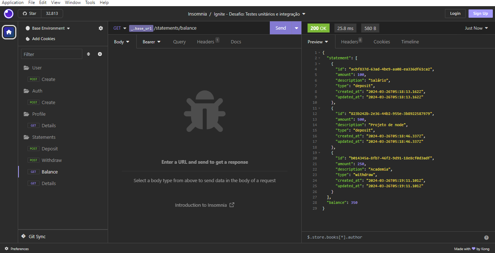

<h1 align="center">
  
</h1>

<h3 align="center">
  Desafio: Testes unitários e integração
</h3>

<p align="center">Criação de testes unitários e integração de uma simples API (FinApi) para controle financeiro utilizando o Node.js</p>

<p align="center">
  <a href="#como-executar-o-projeto">Como executar o projeto</a>&nbsp;&nbsp;&nbsp;|&nbsp;&nbsp;&nbsp;
  <a href="#sobre-o-desafio">Sobre o Desafio</a>
</p>

<p align="center">Back-end</p>

<p align="center">
  
</p>

## Como executar o projeto

### Clonar este repositório

```bash
git clone https://github.com/eliasmcastro/rocketseat-ignite-nodejs-desafio-testes-unitarios-integracao.git
```

### Requisitos

- [Node.js](https://nodejs.org)
- [Yarn](https://yarnpkg.com)
- [Docker](https://www.docker.com)

#### Opcional

- [DBeaver](https://dbeaver.io/)

### Passos para a execução

**1. Instalar as dependências**

```bash
yarn
```

**2. Criar o banco de dados utilizando o Docker**

```bash
docker run --name ignite-challenge-unit-test -e POSTGRES_DB=fin_api -e POSTGRES_PASSWORD=ignite -p 5432:5432 -d postgres
```

**3. Executar as migrations**

```bash
yarn typeorm migration:run
```

**4. Iniciar o servidor de desenvolvimento**

```bash
yarn dev
```

A aplicação começará a ser executada em http://localhost:3333

_Dica: utilizar o Insomnia para testar as rotas_

- Abrir o Insomnia -> Application -> Preferences -> Data -> Import Data -> From File -> Selecionar o arquivo insomnia.json

### Testes automatizados

Antes de executar os testes, é necessário criarmos um banco de dados exclusivo para os testes. Podemos fazer de duas formas:

**1. Utilizando alguma ferramenta (ex: DBeaver) para acesso ao banco de dados**

Acessar a ferramenta que você está utilizando para acessar o banco de dados e criar o banco de dados de teste chamado `fin_api_test` com o comando abaixo:

Dados de conexão:
  - Host: localhost
  - Port: 5432
  - Username: postgres
  - Password: ignite

```sql
create database fin_api_test;
```

**2. Acessando diretamente o container do banco de dados**

Rodar o comando abaixo para obter o CONTAINER ID

```bash
docker ps
```

Acessar o container

```bash
docker exec -it ${CONTAINER ID} bash
```

Acessar o banco postgres

```bash
psql -U postgres
```

Criar o banco de dados de teste

```sql
create database fin_api_test;
```

Visualizar todos os bancos de dados criados

```sql
\l
```

Sair do container

```bash
\q
```

```bash
exit
```

**3. Executar os testes unitários e de integração**

```bash
yarn test
```

## Sobre o desafio

Nesse desafio, você deverá criar testes unitários e de integração para uma aplicação já pronta usando tudo que aprendeu até agora sobre testes.

### Rotas da aplicação

### POST `/api/v1/users`

A rota recebe `name`, `email` e `password` dentro do corpo da requisição, salva o usuário criado no banco e retorna uma resposta vazia com status `201`.

### POST `/api/v1/sessions`

A rota recebe `email` e `password` no corpo da requisição e retorna os dados do usuário autenticado junto à um token JWT.

### GET `/api/v1/profile`

A rota recebe um token JWT pelo header da requisição e retorna as informações do usuário autenticado.

### GET `/api/v1/statements/balance`

A rota recebe um token JWT pelo header da requisição e retorna uma lista com todas as operações de depósito e saque do usuário autenticado e também o saldo total numa propriedade `balance`.

### POST `/api/v1/statements/deposit`

A rota recebe um token JWT pelo header e `amount` e `description` no corpo da requisição, registra a operação de depósito do valor e retorna as informações do depósito criado com status `201`.

### POST `/api/v1/statements/withdraw`

A rota recebe um token JWT pelo header e `amount` e `description` no corpo da requisição, registra a operação de saque do valor (caso o usuário possua saldo válido) e retorna as informações do saque criado com status `201`.

### GET `/api/v1/statements/:statement_id`

A rota recebe um token JWT pelo header e o id de uma operação registrada (saque ou depósito) na URL da rota e retorna as informações da operação encontrada.
